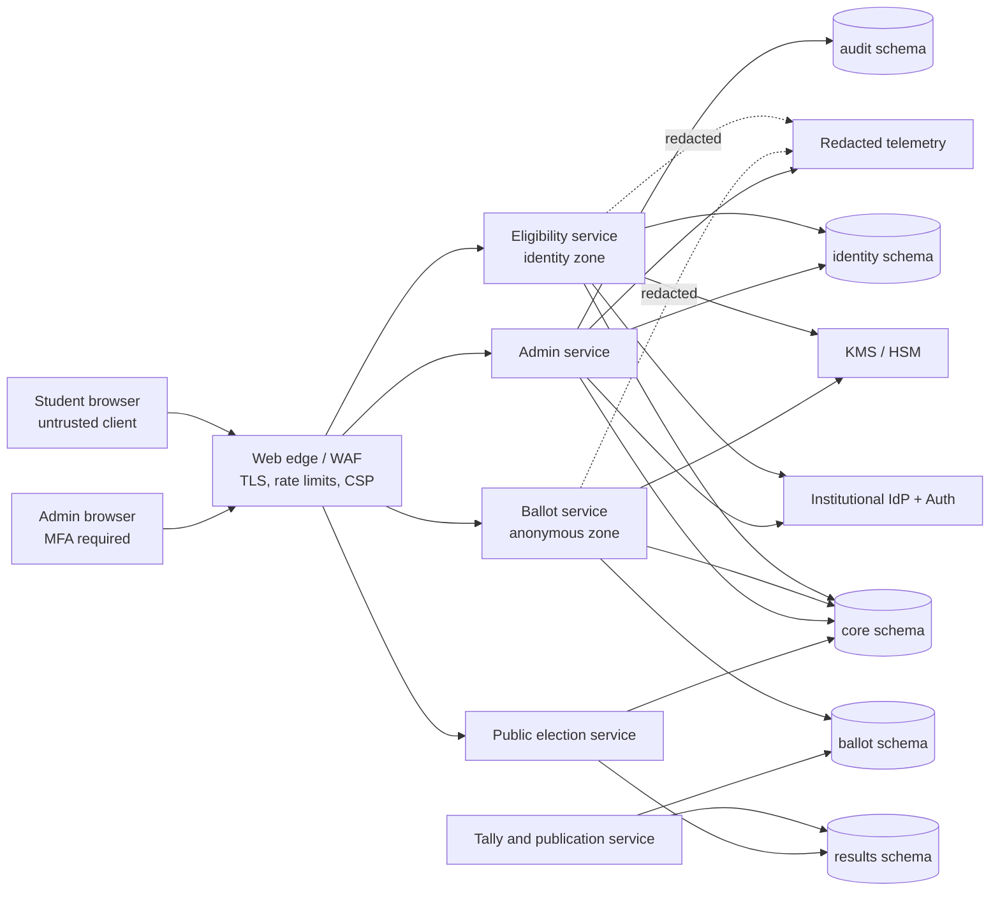

# CampusVote Architecture

Status: Pre-code reference architecture  
Audience: Engineering, security reviewers, election administrators, and operators  
Scope: Campus-wide student elections with authenticated eligibility, one vote per
student per election, anonymous ballot storage, controlled administration, tallying,
and publication.

## Release 1 Implementation Profile

The code in this repository implements the university voting-point workflow requested
for the first release:

- Students verify with a normalized matric number and surname. They do not create a
  Supabase Auth account.
- Elections use the operational states `pending`, `open`, `paused`, and `closed`.
- Verification creates a random 256-bit, 15-minute ballot capability. The raw token
  exists only in a secure, HttpOnly, SameSite=Strict browser cookie; PostgreSQL stores
  only its SHA-256 digest.
- The private ballot-session row contains the student ID for one-voter enforcement,
  but it never stores the anonymous ballot ID, selected candidate IDs, or a link to
  the vote rows.
- The `cast_ballot` PostgreSQL function locks the ballot session, student, and
  election; validates one candidate per configured position; inserts anonymous vote
  rows; sets `students.has_voted` and `students.voted_at`; and consumes the session in
  one transaction.
- `votes` contains no matric number, student ID, name, auth subject, session ID, token,
  or token digest. A random ballot grouping ID keeps selections from one anonymous
  ballot together for database integrity without identifying the voter.
- Admins use Supabase Auth. RLS and server-side role checks implement
  `super_admin`, `election_officer`, and `viewer`. Admin result access is aggregate
  only; normal admin roles receive no raw `votes` or private session-table access.
- The implemented routes are the requested public and `/admin` Next.js routes. The
  database tables retain the requested field names, with narrowly scoped internal
  fields added only where transaction integrity requires them.

This release provides strong ballot secrecy at the application and data-model level,
but it does not claim cryptographic unlinkability from a fully privileged
infrastructure operator. A database, hosting, backup, or network operator with broad
access could attempt timing correlation between verification and ballot submission.
The blind-signature architecture described later in this document is a future
high-assurance option, not a feature that the Release 1 code pretends to implement.

Where later sections describe blind credentials, separate deployable identity/ballot
services, certification states, or KMS key ceremonies, read them as the target
high-assurance evolution beyond the Release 1 profile above.

## 1. Goals and Non-Goals

### Goals

- Admit only eligible students to an election.
- Permit each eligible student to obtain exactly one voting credential per election.
- Prevent replay and double voting under concurrent requests and client retries.
- Store ballots without student IDs, auth user IDs, emails, matriculation numbers,
  issuance-record IDs, IP addresses, user agents, or ballot-session IDs.
- Keep identity processing and ballot processing in distinct trust zones, database
  schemas, credentials, APIs, logs, and operational roles.
- Make election configuration immutable once voting opens.
- Give administrators least-privilege workflows with auditable state transitions.
- Publish results only according to the election's configured release policy.
- Make privacy claims precise and document the limits of those claims.

### Non-Goals

- National-election-grade coercion resistance.
- Protection from a compromised voter device.
- Guaranteed anonymity against collusion by every infrastructure operator, identity
  provider, database superuser, and network provider.
- Fully end-to-end verifiable cryptographic elections in the first release.
- Offline, SMS, USSD, paper, or kiosk voting in the first release.
- Reconstructing which student cast a ballot or how a student voted.

## 2. Architectural Decisions

1. **PostgreSQL is the system of record.** Supabase is the recommended managed
   distribution because it provides PostgreSQL, Auth, Row Level Security (RLS), and
   storage, but the design avoids depending on browser access to privileged tables.
2. **The web client is untrusted.** It may render election data and perform the blind
   credential protocol, but all authorization, election-state checks, ballot
   validation, uniqueness checks, and state changes occur server-side.
3. **Identity and ballots are separate domains.** They use separate schemas,
   application services, database roles, logs, and deployment secrets.
4. **A blind-signed credential separates authentication from voting.** The
   eligibility service authenticates a student and signs a blinded, client-created
   election credential. It cannot see the credential serial later presented to the
   ballot service.
5. **A one-time ballot session is a bearer capability.** The client creates a
   high-entropy session secret. The ballot service stores only a keyed digest and
   atomically consumes the session when accepting a ballot.
6. **Ballots are append-only.** Normal application roles cannot update or delete a
   cast ballot or selection.
7. **RLS is defense in depth, not the only authorization layer.** Sensitive writes
   are available only through narrow server-side functions or service methods.
8. **Raw ballots are not an administrator feature.** Administrators see aggregate
   turnout and results, never a per-student record and normally never raw ballot rows.

## 3. Recommended Technology Baseline

- Web application: Next.js with TypeScript and server-rendered public/admin pages.
- Authentication: Supabase Auth using institutional OIDC/SAML where available;
  verified institutional email is an interim fallback.
- Origins: authenticated pages on an application origin and anonymous session/cast
  endpoints on a separate ballot origin. Authentication cookies are host-only and
  are never sent to the ballot origin.
- Database: PostgreSQL 16+ with RLS, transactional functions, constraints, and
  separate schemas.
- Cryptography: an audited implementation of RFC 9474 RSA blind signatures, using
  a unique signing key per election. Do not implement blind-signature primitives
  directly.
- Key custody: cloud KMS/HSM. Private signing keys and digest peppers are not stored
  in PostgreSQL or client-visible environment variables.
- Candidate media: private object storage with sanitized, generated public variants.
- Observability: structured server logs, metrics, and traces with explicit field
  redaction and no third-party session replay on voting routes.

The deployment platform may change without changing the domain boundaries. Server
handlers that process credentials or ballots must run in a runtime that supports the
selected audited cryptography library and KMS integration.

## 4. System Architecture



### Service Responsibilities

| Service | Responsibilities | Must not access |
|---|---|---|
| Public election | Published elections, contests, candidates, schedules, aggregate results | Student identity, issuance details, ballot sessions, raw ballots |
| Eligibility | Authentication, eligibility snapshot lookup, one blind signature per voter/election, issuance status | Ballot sessions, ballots, selections, raw result inputs |
| Ballot | Credential verification, nullifier redemption, session creation, ballot validation, atomic cast | Auth users, profiles, student numbers, issuance records |
| Admin | Election setup, eligibility import/snapshot, role-governed transitions, audit events | Credential secrets, ballot-session tokens, raw ballot browsing |
| Tally | Deterministic tally after close, integrity checks, signed result snapshots | Student identity and issuance records |

## 5. Trust Boundaries

### Boundary A: Browser to Application

The browser is attacker-controlled. All submitted IDs, candidate choices, election
state, timestamps, role claims, and cryptographic inputs are revalidated. Client-side
validation exists only for usability.

### Boundary B: Authentication and Eligibility

Authentication proves account control, not voting eligibility. Eligibility comes from
an election-specific immutable snapshot. JWT claims may identify the caller but are
not accepted as the only source of eligibility.

### Boundary C: Identity Zone to Anonymous Ballot Zone

There is no authenticated request forwarding from eligibility to ballot casting.
The bridge is a blind-signed bearer credential:

- The identity zone observes the student and a blinded message.
- The ballot zone observes the unblinded message and valid signature.
- Neither application schema contains a direct identity-to-credential or
  identity-to-ballot link.
- The services use different database roles, KMS grants, telemetry streams, and
  ideally separate deployable processes.

### Boundary D: Application to Database

Browser clients do not receive a broad database service key. Direct table privileges
are revoked for sensitive schemas. Server roles call narrowly scoped database
functions, and those functions set an explicit `search_path`, validate caller role,
and avoid dynamic SQL.

### Boundary E: Database to KMS

Election private keys and HMAC peppers remain in KMS/HSM. PostgreSQL stores public
keys, key IDs, algorithm versions, and encrypted idempotency artifacts only. KMS
policies permit signing to the eligibility service and digest/verification operations
to the ballot service as narrowly as the provider supports.

### Boundary F: Operations and Backups

Database superusers, backup operators, WAL archives, cloud control planes, and
incident tooling are outside application RLS. Access is restricted, logged, reviewed,
and subject to dual control, but this is an operational rather than cryptographic
guarantee.

### Threat Summary

| Threat | Primary controls | Residual risk |
|---|---|---|
| Ineligible voting | Institutional auth, immutable eligibility snapshot, one issuance constraint | Compromised or incorrectly provisioned institutional identity |
| Double voting/replay | One issuance, unique credential nullifier, one-time session, row lock, atomic cast | Flaw in cryptographic protocol or privileged database tampering |
| Credential theft | High-entropy secrets, short session expiry, CSP, encrypted client recovery state | Compromised device, malicious extension, deliberate transfer |
| Ballot attribution | Blind credential, separate origins/services/roles, no ballot identity fields, redacted logs | Timing correlation, infrastructure collusion, small-cohort inference |
| Ballot alteration | Frozen configuration, append-only privileges, constraints, integrity hashes, deterministic tally | Database superuser or backup-layer manipulation without stronger public verification |
| Admin abuse | MFA, scoped roles, dual control, append-only audit, no raw-ballot UI | Colluding privileged operators |
| Premature result disclosure | No raw-ballot admin access, tally role gated on close, release policy | Database/cloud superuser access |
| Availability attack | WAF, rate limits, capacity headroom, pooling, monitoring, restore drills | Large upstream or identity-provider outage |
| Client injection/XSS | Strict CSP, Trusted Types, dependency controls, no third-party scripts | Browser zero-day or compromised first-party dependency |
| Coercion/vote selling | No choice-bearing receipt, no dashboard ballot link | Bearer credential transfer and observed voting remain possible |

## 6. Core Election State Model

Allowed states:

`draft -> scheduled -> open -> closed -> tallied -> certified -> published -> archived`

Exceptional terminal state:

`draft|scheduled|open -> cancelled`

Rules:

- `draft`: configuration is editable.
- `scheduled`: configuration is frozen except for an audited return to `draft`.
- `open`: contests, candidates, eligibility snapshot, public key, and ballot version
  are immutable.
- `closed`: no new sessions and no ballot casting.
- `tallied`: a deterministic tally snapshot exists.
- `certified`: authorized approvers accepted a specific tally snapshot.
- `published`: public result projections are readable.
- `archived`: retention policy applies; records remain immutable.
- Closing is monotonic. Reopening a production election is prohibited. A replacement
  election is created instead.
- State transitions use compare-and-swap semantics on a row version to prevent two
  administrators from racing.

## 7. Database Architecture

All IDs are server-generated UUIDv4 values unless an ordered public slug is needed.
All timestamps are `timestamptz` stored in UTC. Identity-side and ballot-side
timestamps should be coarsened in administrator views.

### `core` Schema

#### `core.campuses`

- `id`
- `name`
- `slug` unique
- `timezone`
- `active`
- `created_at`

#### `core.elections`

- `id`
- `campus_id`
- `title`
- `slug`
- `description`
- `status`
- `opens_at`
- `closes_at`
- `results_release_policy` (`immediate_after_close`, `after_certification`, `manual`)
- `ballot_version` monotonically increasing before freeze
- `minimum_publish_cohort` to suppress identifying micro-results
- `configuration_hash` over frozen contests/candidates/rules
- `row_version` for optimistic concurrency
- `created_by`
- `created_at`, `updated_at`

Constraints:

- Unique `(campus_id, slug)`.
- `opens_at < closes_at`.
- State and time windows agree.
- Updates to frozen fields are rejected at `open` or later.

#### `core.contests`

- `id`
- `election_id`
- `title`
- `description`
- `display_order`
- `min_selections` default `0`
- `max_selections` default `1`
- `allow_abstain`
- `published`

Constraints:

- Unique `(election_id, display_order)`.
- `0 <= min_selections <= max_selections`.

#### `core.candidates`

- `id`
- `contest_id`
- `display_name`
- `manifesto_summary`
- `photo_asset_id` nullable
- `display_order`
- `status` (`active`, `withdrawn`)
- `created_at`, `updated_at`

A withdrawn candidate is retained for audit. Withdrawal behavior after opening must
be defined in the election rules and cannot silently rewrite already cast ballots.

#### `core.election_keys`

- `id`
- `election_id` unique
- `algorithm`
- `public_key`
- `kms_key_reference` visible only to the eligibility service/operator
- `key_version`
- `activated_at`
- `destroy_after`

Each election has a distinct key. Rotation after credential issuance invalidates all
credentials under the old key and therefore requires a formally declared restart.

#### `core.election_state_transitions`

- `id`
- `election_id`
- `from_state`
- `to_state`
- `actor_user_id`
- `reason`
- `configuration_hash`
- `created_at`

This is append-only and identity-bearing, but it contains no ballot/session values.

### `identity` Schema

#### `identity.student_profiles`

- `user_id` primary key, referencing the auth provider identity
- `student_number_ciphertext`
- `student_number_lookup_hash` unique, keyed with an identity-zone pepper
- `institutional_email`
- `campus_id`
- `department_code`
- `level_code`
- `enrollment_status`
- `source_updated_at`
- `created_at`, `updated_at`

Student numbers are encrypted for recovery and separately represented by a keyed
lookup hash for uniqueness. Plain student numbers never appear in logs.

#### `identity.role_assignments`

- `id`
- `user_id`
- `campus_id` nullable for platform scope
- `role` (`student`, `election_admin`, `eligibility_officer`, `auditor`,
  `result_approver`, `platform_admin`)
- `granted_by`
- `granted_at`
- `expires_at` nullable
- `revoked_at` nullable

Role changes require a fresh auth token or server-side lookup; stale JWTs do not retain
revoked admin access.

#### `identity.election_eligibility`

An immutable snapshot taken before scheduling:

- `id`
- `election_id`
- `user_id`
- `eligible`
- `reason_code`
- `snapshot_version`
- `snapshotted_at`

Constraints:

- Unique `(election_id, user_id)`.
- No inserts or updates after the election opens.

#### `identity.credential_issuances`

- `id`
- `election_id`
- `user_id`
- `status` (`pending`, `issued`, `failed`)
- `blind_request_digest`
- `encrypted_blind_response` for same-request recovery
- `protocol_version`
- `attempt_count`
- `issued_at`
- `last_attempt_at`

Constraints and privacy properties:

- Unique `(election_id, user_id)` enforces one issuance.
- The blinded request and response do not reveal the final credential serial under
  the blind-signature security assumptions.
- This table never stores the unblinded message, serial, nullifier, ballot-session
  digest, ballot ID, or choices.
- A retry with the same blinded request can return the encrypted prior response.
  A different request after successful issuance is rejected.

### `ballot` Schema

The ballot schema contains no foreign keys to `auth` or `identity`.

#### `ballot.ballot_sessions`

- `id`
- `election_id`
- `credential_nullifier` unique within the election
- `token_digest` unique, calculated as a versioned HMAC over
  `SHA-256(client-generated 256-bit session secret)`
- `digest_key_version`
- `status` (`open`, `consumed`, `expired`)
- `created_at`
- `expires_at`
- `consumed_at` nullable
- `cast_request_digest` nullable, used only to recognize an exact retry

Properties:

- No user ID, student number, auth subject, issuance ID, IP, user agent, or
  authenticated request ID.
- The credential nullifier prevents one blind credential from creating more than one
  ballot session.
- The raw session secret is never stored server-side.
- A session is short-lived, normally 15 minutes, but remains retryable after a
  successful cast so the client can learn that its prior request committed.

#### `ballot.ballots`

- `id`
- `election_id`
- `ballot_version`
- `cast_at`
- `validation_version`
- `integrity_hash`

Properties:

- There is deliberately no `user_id`, `session_id`, `credential_nullifier`,
  issuance ID, IP, user agent, or admin-created attribution field.
- There is deliberately no foreign key from a ballot to `ballot_sessions`.
- `cast_at` is needed operationally but is not exposed at full precision outside the
  ballot service or tally process.
- Rows are insert-only.

#### `ballot.ballot_contests`

- `ballot_id`
- `contest_id`
- `abstained`

Constraints:

- Primary key `(ballot_id, contest_id)`.
- Contest must belong to the ballot's election and frozen ballot version.
- Abstention and candidate selections are mutually exclusive.

#### `ballot.ballot_selections`

- `ballot_id`
- `contest_id`
- `candidate_id`

Constraints:

- Primary key `(ballot_id, contest_id, candidate_id)`.
- Candidate must belong to the contest.
- A deferred constraint trigger validates min/max selections at transaction commit.
- No selection may reference a withdrawn candidate unless election rules explicitly
  permit votes cast before withdrawal to remain valid.

#### `ballot.cast_security_events`

- `id`
- `election_id`
- `event_type`
- `coarse_time_bucket`
- `count`

Only aggregated security events are retained. Per-request IPs and user agents may be
held temporarily at the WAF for abuse control under a short retention policy, but are
not copied into the ballot database.

### `results` Schema

#### `results.tally_runs`

- `id`
- `election_id`
- `input_integrity_hash`
- `algorithm_version`
- `started_at`, `completed_at`
- `status`
- `performed_by_service`

#### `results.contest_totals`

- `tally_run_id`
- `contest_id`
- `candidate_id` nullable for abstention/invalid aggregate
- `vote_count`

#### `results.certifications`

- `id`
- `tally_run_id`
- `approver_user_id`
- `decision`
- `comment`
- `created_at`

At least two distinct result approvers are recommended for certification.

#### `results.published_results`

- `election_id`
- `tally_run_id`
- `projection_json`
- `published_at`
- `published_by`
- `signature`

The projection is generated from certified totals and excludes small-cohort
breakdowns below `minimum_publish_cohort`.

### `audit` Schema

#### `audit.admin_events`

- `id`
- `actor_user_id`
- `actor_role`
- `action`
- `target_type`
- `target_id`
- `before_hash`
- `after_hash`
- `reason`
- `created_at`
- `request_id`

Audit metadata is allow-listed. It must not contain student numbers, blind requests,
credential serials, nullifiers, session tokens/digests, ballot IDs, or selections.

## 8. Blind Credential and Ballot Session Protocol

### Credential Acquisition

1. The authenticated client downloads the election ID, ballot version, key ID, public
   key, and protocol version.
2. The client generates a cryptographically random 256-bit credential serial and
   persists the unfinished issuance state encrypted with Web Crypto before requesting
   a signature.
3. The client canonicalizes a credential message containing protocol domain,
   election ID, ballot version, key ID, and serial.
4. The client blinds the message and sends the blinded request to the eligibility
   service over an authenticated, CSRF-protected request.
5. The service verifies the election is open or in its allowed pre-issue window,
   locks `(election_id, user_id)`, checks the immutable eligibility snapshot, and
   creates or resumes one issuance row.
6. KMS signs the blinded request. The response is stored encrypted for an idempotent
   retry and returned to the client.
7. The client unblinds and verifies the signature locally. The eligibility service
   never observes the final serial or unblinded credential.

### Ballot Session Creation

1. The client generates a separate random 256-bit session secret and retains it
   locally.
2. The client computes `client_token_hash = SHA-256(session_secret)` and sends the
   unblinded credential, signature, and `client_token_hash` to the anonymous ballot
   origin. The host-only auth cookie is not available on this origin, and requests
   that unexpectedly contain identity credentials are rejected.
3. The ballot service verifies the election key, credential domain, election ID,
   ballot version, signature, election state, and time window.
4. It derives the credential nullifier and
   `token_digest = HMAC(digest_pepper_version, client_token_hash)`.
5. In one transaction it inserts one `ballot_sessions` row. The unique election
   nullifier rejects credential replay. The unique token digest rejects token reuse.
6. If the network response is lost, the client still holds the session secret and can
   proceed or retry safely.

### Ballot Casting

1. The client sends the session secret and the complete ballot payload.
2. The ballot service calculates `SHA-256(session_secret)` and then the versioned
   HMAC token digest before beginning a database transaction.
3. It locks the matching session row with `SELECT ... FOR UPDATE`.
4. It verifies `status = open`, expiry, election state, ballot version, contest
   completeness, candidate membership, and min/max selections.
5. It inserts a new anonymous `ballots` row and all contest/selection rows.
6. It changes the session to `consumed` in the same transaction and commits.
7. It returns a deterministic confirmation code derived from the session digest,
   suitable for retry confirmation but not linked from the ballot row.
8. An exact retry returns "already accepted" and the same confirmation code. A
   changed payload for a consumed session is rejected and recorded only as an
   aggregate security event.

The transaction means a crash cannot consume a session without committing its ballot,
or commit a ballot while leaving the session reusable.

## 9. Double-Voting Strategy

Double voting is prevented at multiple independent layers:

1. Unique `(election_id, user_id)` in `credential_issuances`: one signed credential
   issuance per eligible identity.
2. A blind credential signature bound to one election key and ballot version:
   credentials cannot be moved to another election.
3. Unique `(election_id, credential_nullifier)` in `ballot_sessions`: one session per
   credential, even under concurrent requests.
4. A random one-time session secret stored only as a keyed digest: possession is
   required to cast.
5. Row locking plus atomic session consumption and ballot insertion: concurrent cast
   requests yield at most one committed ballot.
6. Database constraints: application bugs cannot bypass the one-issuance and
   one-nullifier rules.
7. Idempotent retries: uncertain network delivery does not create a second ballot.

The system must not rely on a `has_voted` client flag, an admin-controlled boolean, a
read-then-write sequence without a unique constraint, or a vote row containing the
student ID.

### Credential Loss and Reissue

Strong unlinkability creates a real recovery tradeoff. Once a blind credential has
been issued, the eligibility service cannot identify and revoke that individual
credential because it never learned its serial. Automatically issuing another
credential would permit two ballots.

Therefore:

- The client persists issuance material before requesting the blind signature.
- The same blinded request is idempotently recoverable.
- A successfully issued but irretrievably lost credential is not automatically
  reissued.
- Any exceptional reissue requires a formally documented election policy. A safe
  high-assurance option is to restart credential issuance for the entire election
  under a new key before voting opens. Reissuing only to one user weakens the
  one-person-one-vote guarantee.

This limitation must be tested in usability trials and communicated before launch.

## 10. Anonymous Vote Protection

- No identity fields or identity foreign keys exist in the ballot schema.
- Eligibility never receives the final credential serial.
- Ballot endpoints do not require or inspect the student's auth cookie.
- Ballots do not reference sessions; sessions do not reference issuance records.
- Identity and ballot services have mutually exclusive database privileges.
- Candidate selections are never included in application logs, analytics, traces,
  error reports, audit metadata, or support tickets.
- No Google Analytics, Meta Pixel, session replay, heatmap, or third-party chat widget
  runs on credential or ballot routes.
- Full-precision cast times and session creation times are hidden from admins.
- Administrative turnout is shown in coarse time buckets and suppressed for small
  groups.
- Ballot IDs are random, not sequential.
- Confirmation codes do not encode choices and are not proof of how a student voted.
- Database exports exclude the identity and ballot schemas from a single combined
  analyst dataset.

The anonymous zone still links a ballot's selections together. That is necessary for
ballot-level validation, but unusual choice patterns can be identifying in small
elections. Raw ballot access is therefore denied even after publication.

## 11. Student Flow

1. Student signs in through the institutional identity provider.
2. The dashboard shows current elections and the student's eligibility/issuance
   status, not whether a specific anonymous ballot exists.
3. Student opens an election and reviews schedule, rules, contests, and candidates.
4. Client acquires or resumes the blind credential.
5. Client creates an anonymous one-time ballot session.
6. Student fills contests locally. Validation is shown without transmitting choices.
7. Review screen lists all selections and explicit abstentions.
8. Student confirms once. The cast control becomes pending and is guarded against
   accidental duplicate clicks, while server-side idempotency remains authoritative.
9. On success, the client erases credential/session material and shows a neutral
   confirmation code.
10. Returning to the authenticated dashboard shows only "credential issued." It does
    not query or reveal a ballot link. The UI may explain that issuance is not a
    public proof of participation.

Accessibility requirements include keyboard-only operation, screen-reader labels,
visible focus, non-color status cues, WCAG 2.2 AA contrast, responsive layouts, and a
low-bandwidth mode without candidate media.

## 12. Administrator Flow

1. Platform admin grants scoped roles with expiry. Admin accounts require MFA.
2. Election admin creates a draft election, contests, candidates, schedule, and
   result-release policy.
3. Eligibility officer imports or synchronizes the student roster and creates an
   election-specific eligibility snapshot.
4. Election admin runs preflight validation: schedule, candidate membership,
   contest limits, key availability, snapshot counts, accessibility, and publication
   threshold.
5. A second authorized admin schedules the election. The configuration hash and
   public key are recorded.
6. At opening, the state transition freezes the configuration. Operators monitor
   service health and coarse aggregate counts, not individual voting activity.
7. At closing, new sessions and casts are rejected based on server/database time.
8. Tally service verifies ballot integrity and produces a deterministic tally run.
9. Two result approvers review counts, integrity checks, and exception reports.
10. An approved tally is certified and published according to policy.
11. Audit events and signed result artifacts are retained. Raw ballots remain
    unavailable to normal administrators.

Admins cannot:

- cast on behalf of a student;
- manually toggle a student's `has_voted` state;
- inspect a student's credential;
- search ballots by student, IP, time, or session;
- edit or delete a cast ballot;
- change candidates, contests, eligibility, or keys after opening;
- publish an uncertified result when certification is required.

## 13. Authorization and RLS Matrix

Application roles are resolved server-side from `identity.role_assignments`. Database
service roles are separate from human roles.

Legend: `R` read, `W` constrained write, `A` aggregate-only read, `F` function-only,
`-` no access.

| Actor | Core election config | Own profile/eligibility | All eligibility | Issuances | Ballot sessions | Raw ballots/selections | Results | Admin audit |
|---|---:|---:|---:|---:|---:|---:|---:|---:|
| Anonymous | Published `R` | - | - | - | `F` create/cast only | - | Published `R` | - |
| Student | Published `R` | Own `R` | - | Own status/`F` issue | `F` only | - | Published `R` | - |
| Election admin | Scoped `R/W` before freeze | - | Counts `A` | Counts `A` | Counts `A` | - | Scoped `R` | Scoped `R` |
| Eligibility officer | Scoped `R` | - | Scoped `R/W` before freeze | Counts/status `A` | - | - | - | Scoped `R` |
| Auditor | Frozen config `R` | - | Counts `A` | Counts `A` | Counts `A` | - | `R` | `R` |
| Result approver | Frozen config `R` | - | - | - | - | - | Tally/certify `R/W` | Certification `R` |
| Platform admin | Scoped operational `R/W` | Support `R` | Scoped `R` | Counts `A` | Counts `A` | - | `R` | `R` |
| Eligibility service DB role | `R` election/key metadata | `R` | Scoped `R` | `F/R/W` | - | - | - | Append safe event |
| Ballot service DB role | Frozen config `R` | - | - | - | `F/R/W` | Insert only via `F` | - | - |
| Tally service DB role | Frozen config `R` | - | - | - | - | Read after close | `F/R/W` | Append safe event |

### RLS Policy Requirements

- Public policies expose explicit projections, never `SELECT *`.
- Student policies compare auth subject only in the identity schema.
- There is no student/anonymous `SELECT` policy on ballot sessions, ballots, or
  selections.
- Ballot writes occur through a `SECURITY DEFINER` function owned by a non-login role;
  direct `INSERT`, `UPDATE`, and `DELETE` are revoked.
- The cast function fixes its `search_path`, validates election state within the
  transaction, and does not accept caller-supplied timestamps or ballot IDs.
- Admin policies require active role assignment, campus/election scope, and election
  state checks.
- Platform administrators do not receive application-level raw-ballot access.
- Tally read access is enabled only when the election is closed and only for the
  specific tally job.
- Every RLS policy has positive, negative, cross-campus, stale-role, and direct-table
  tests.
- A generic Supabase `service_role` key is not used by routine web handlers because it
  bypasses RLS. If the hosting model forces its use, handlers still connect through
  narrowly privileged database functions and the key is isolated per service.

## 14. Security Controls

### Authentication and Administration

- Institutional SSO where possible; verified email fallback only with roster match.
- MFA and recent-auth step-up for role grants, scheduling, closing, certification,
  publication, and key operations.
- Short admin sessions, secure logout, role expiry, and immediate revocation lookup.
- Dual control for scheduling, cancellation, certification, and publication.

### Web and API

- TLS only, HSTS, secure cookies, `HttpOnly`, `SameSite=Lax` or stricter where
  compatible, and explicit Origin validation.
- CSRF tokens on authenticated mutations.
- Strict CSP with nonces, Trusted Types where supported, no inline third-party
  scripts on voting pages, and dependency integrity controls.
- Schema validation with unknown-field rejection and bounded payload sizes.
- Per-route rate limits: account-based for issuance, token/IP risk-based for
  anonymous endpoints, and stricter admin limits.
- Generic errors that do not disclose roster membership, token validity details, or
  candidate counts before publication.

### Data and Cryptography

- Encryption in transit and at rest.
- Field encryption for student numbers and idempotent blind responses.
- Keyed lookup hashes rather than plain hashes for low-entropy identifiers.
- Unique election signing keys, algorithm/version agility, and documented rotation.
- Constant-time comparisons for token digests and signatures where library APIs
  require caller comparison.
- Cryptographically secure randomness only.
- No custom cryptographic primitive or hand-written blind-signature math.

### Integrity and Availability

- Database constraints are authoritative.
- Cast operations use serializable behavior or row locks sufficient to prove the
  one-session/one-ballot invariant under load tests.
- Frozen configuration hash is checked by tally.
- Append-only ballots and tamper-evident integrity hashes.
- Point-in-time recovery, encrypted backups, restore drills, and election-day
  runbooks.
- WAF, queue/backpressure limits, capacity tests, health probes, and database
  connection pooling.
- Server and database clocks synchronized; database time decides open/close windows.

### Secure Development

- Threat-model review before credential implementation.
- Secret scanning, dependency scanning, SAST, migration review, and protected main
  branch.
- Unit, integration, property, concurrency, RLS, and end-to-end tests.
- Independent security review of credential issuance and casting before production.

## 15. Component Architecture

### Student UI

- `ElectionDashboard`: published elections and eligibility/issuance status.
- `ElectionOverview`: schedule, rules, privacy notice, and candidate navigation.
- `CredentialManager`: client-only issuance state machine and encrypted recovery.
- `BallotComposer`: local ballot state; never sends partial selections.
- `ContestSection`: one contest, instructions, limits, and validation.
- `CandidateOption`: accessible candidate choice presentation.
- `BallotReview`: complete selections/abstentions and final confirmation.
- `CastController`: creates session, submits one idempotent cast request, handles
  uncertainty and retries.
- `CastConfirmation`: neutral accepted/already-accepted outcome and cleanup.

### Admin UI

- `AdminElectionList`
- `ElectionEditor`
- `ContestEditor`
- `CandidateEditor`
- `EligibilitySnapshotPanel`
- `ElectionPreflight`
- `ElectionStateControls`
- `CoarseTurnoutMonitor`
- `TallyReview`
- `CertificationPanel`
- `AuditEventViewer`

Admin components call server-side use cases; none connect directly to sensitive
tables.

### Server Modules

- `auth`: session validation, step-up, role resolution.
- `elections`: state machine, frozen configuration, public projections.
- `eligibility`: roster snapshots and eligibility decisions.
- `credentials`: blind request validation, KMS signing, issuance idempotency.
- `ballot-sessions`: credential verification, nullifier redemption, session digest.
- `ballots`: canonical validation and atomic cast.
- `tally`: deterministic aggregation and integrity checks.
- `results`: certification and public projection.
- `audit`: allow-listed administrative events.
- `observability`: redaction, metrics, trace boundaries.

Domain modules do not import UI or deployment code. The ballot module has no import
path to identity repositories.

## 16. Proposed Repository Structure

```text
/
|-- apps/
|   `-- web/
|       |-- src/app/
|       |   |-- (public)/
|       |   |-- (student)/
|       |   |-- admin/
|       |   `-- api/
|       |       |-- eligibility/
|       |       |-- ballot/
|       |       `-- admin/
|       |-- src/components/
|       |   |-- student/
|       |   |-- admin/
|       |   `-- shared/
|       `-- src/lib/
|-- packages/
|   |-- domain/
|   |   |-- elections/
|   |   |-- eligibility/
|   |   |-- ballots/
|   |   `-- results/
|   |-- crypto/
|   |-- database/
|   |   |-- identity/
|   |   |-- ballot/
|   |   `-- admin/
|   |-- validation/
|   |-- ui/
|   `-- config/
|-- supabase/
|   |-- migrations/
|   |-- functions/
|   |-- policies/
|   |-- seed/
|   `-- tests/
|-- tests/
|   |-- e2e/
|   |-- concurrency/
|   |-- privacy/
|   `-- security/
|-- docs/
|   |-- ARCHITECTURE.md
|   |-- THREAT_MODEL.md
|   |-- RUNBOOK.md
|   `-- PRIVACY_NOTICE.md
`-- tooling/
```

Separate repository packages do not by themselves create a security boundary.
Deployment identities, database roles, KMS grants, and network policies enforce the
boundary.

## 17. Key State Machines and Invariants

### Credential State

`not_issued -> pending -> issued`

`pending -> failed -> pending` is allowed only for the same blinded request.

### Ballot Session State

`open -> consumed` or `open -> expired`

Consumed and expired states are terminal.

### Required Invariants

- One eligibility snapshot row per student/election.
- One credential issuance per student/election.
- No unblinded credential data in the identity schema.
- One ballot session per election credential nullifier.
- One committed ballot per consumed session transaction.
- No identity/session/nullifier columns in ballots or selections.
- A ballot contains exactly the allowed contests for its frozen ballot version.
- Every selection belongs to its contest and election.
- Frozen configuration cannot change at or after opening.
- Results derive from one identified tally run and cannot precede closing.
- No human application role can mutate cast ballots.

## 18. Testing Strategy

### Domain and Database

- Election state transition table tests.
- Contest min/max, abstention, candidate membership, and frozen-version tests.
- Constraint tests for duplicate issuance, duplicate nullifier, duplicate session
  token, duplicate selection, and cross-election references.
- Property tests for ballot canonicalization and integrity hashes.

### Concurrency

- Hundreds of simultaneous issuance requests for one user produce one issuance.
- Simultaneous session creation with one credential produces one session.
- Simultaneous cast requests with one session produce exactly one ballot.
- Transaction interruption at each cast step produces either no ballot/open session
  or one ballot/consumed session, never a split state.
- Exact retries return accepted; changed retries are rejected.

### RLS and Privacy

- Every actor in the matrix is tested against every protected table/function.
- Cross-campus and cross-election access fails.
- Students cannot enumerate eligibility or issuance rows.
- Admins cannot select raw ballots or precise cast times.
- Ballot service credentials cannot query identity tables and vice versa.
- Log-capture tests fail builds if forbidden fields appear.
- Static schema checks fail if identity-like columns or foreign keys are added to the
  ballot schema.

### End-to-End

- Eligible and ineligible student flows.
- Interrupted credential acquisition and same-request recovery.
- Lost response after successful cast.
- Election closes while a ballot is being reviewed or submitted.
- Candidate withdrawal according to policy.
- Tally, dual certification, publication, and cancellation.
- Keyboard, screen-reader, low-bandwidth, mobile, and timezone behavior.

## 19. Implementation Plan

### Phase 0: Governance and Threat Model

- Approve election rules, privacy claim, retention periods, reissue policy, incident
  authority, and administrator separation of duties.
- Select and review the blind-signature library and KMS support.
- Define measurable load and availability targets.

### Phase 1: Foundations

- Create workspace, CI, environments, secret management, database schemas, migration
  discipline, and local test harness.
- Implement auth integration, role assignments, state machine, and audit allow-list.
- Add automated RLS and schema-boundary tests before feature tables are exposed.

### Phase 2: Election Administration

- Implement draft election, contests, candidates, media handling, eligibility
  snapshot, preflight, scheduling, and freeze rules.
- Add MFA step-up and dual-control transitions.

### Phase 3: Credential Issuance

- Implement client issuance state, encrypted retry recovery, eligibility transaction,
  KMS blind signing, protocol versioning, and one-issuance constraints.
- Complete focused cryptographic and privacy review.

### Phase 4: Anonymous Casting

- Implement unauthenticated ballot endpoint, credential verification, nullifier
  redemption, one-time sessions, full ballot validation, atomic cast, retry
  confirmation, and cleanup.
- Run concurrency, replay, CSRF, XSS, and logging tests.

### Phase 5: Tally and Publication

- Implement integrity verification, deterministic tally, result snapshots, dual
  certification, minimum cohort suppression, signed publication, and public pages.

### Phase 6: Operational Hardening

- Capacity test at several times expected peak.
- Restore drill, key ceremony rehearsal, close/tally rehearsal, monitoring, alerting,
  WAF rules, and incident exercises.
- Independent penetration test and privacy review.

### Phase 7: Pilot and Launch

- Run a non-binding pilot with realistic devices and network conditions.
- Resolve credential recovery and accessibility findings.
- Freeze the production release, conduct election-day go/no-go review, and archive
  signed artifacts after completion.

## 20. Operational Assumptions

- The institution has an authoritative student roster and can produce a stable auth
  identity for each student.
- Election eligibility can be snapshotted before voting starts.
- Students use modern browsers with Web Crypto and JavaScript enabled.
- Students have network access during voting; offline casting is unsupported.
- One election normally has fewer than 100,000 eligible voters. Capacity targets must
  be revised if this assumption changes.
- Peak traffic may be concentrated near closing time; load tests model at least 20%
  of eligible voters attempting access within five minutes.
- The institution can operate KMS/HSM-backed keys and two-person administrative
  approvals.
- Database, application, and KMS clocks are synchronized.
- Election administrators are not database superusers.
- Support staff cannot resolve a ballot to a voter and accept that some credential
  loss cases cannot be repaired individually.
- Legal counsel or institutional governance defines retention and disclosure duties.
- Production uses isolated development, staging, and production projects with no
  copied production identity or ballot data.

## 21. Privacy Limitations

CampusVote provides strong application-layer separation and blind-credential
unlinkability, but it must not advertise absolute anonymity.

Explicit limitations:

1. The identity provider and eligibility service know that a student authenticated
   and obtained a credential, and approximately when.
2. The CDN, WAF, hosting provider, and network operators may observe source IP and
   request timing. Colluding operators could attempt timing correlation between
   credential acquisition and ballot activity.
3. A database/cloud superuser with access to identity data, ballot data, WAL,
   backups, and detailed infrastructure logs may perform correlation outside RLS.
4. Blind signatures protect the credential link only if the chosen protocol,
   implementation, randomness, key custody, and client behavior are correct.
5. Browser compromise, malicious extensions, spyware, screenshots, or shoulder
   surfing can reveal choices before encryption in transit.
6. A student can transfer or sell a bearer credential. Device or identity binding
   would reduce transfer but would also weaken ballot anonymity.
7. Small elections, very small cohorts, unusual multi-contest choice patterns, and
   published demographic breakdowns can enable inference. CampusVote suppresses
   small breakdowns but cannot remove all contextual inference.
8. The system is not fully coercion-resistant. A coercer can observe a student's
   screen or demand credential transfer, though the confirmation code does not prove
   vote content.
9. The first release does not provide universal end-to-end verifiability. Voters
   receive acceptance confirmation, not cryptographic proof that their choices were
   included in the final tally.
10. Immutable backups and legal holds may retain identity and ballot datasets longer
    than normal application retention, even though they remain logically separated.
11. Incident response tooling can accidentally weaken privacy if verbose logging or
    packet capture is enabled. Election-day diagnostics require a privacy-specific
    approval procedure.
12. Exact credential loss cannot always be repaired without weakening either
    unlinkability or one-person-one-vote.

The public privacy notice must distinguish:

- authentication and eligibility records;
- anonymous ballot records;
- temporary network security logs;
- aggregate results;
- retention and deletion behavior;
- who can access each category;
- the limitations above.

## 22. Operational Metrics Without Voter Tracking

Allowed metrics:

- request count, latency, error rate, saturation, and database contention;
- aggregate credentials issued by election;
- aggregate open/consumed/expired sessions;
- aggregate accepted ballots;
- coarse time buckets with a minimum reporting threshold;
- tally integrity failures and admin transition events.

Forbidden metrics and dimensions:

- choices or candidate IDs on ballot routes;
- student IDs, emails, student numbers, auth subjects, credential material,
  nullifiers, token digests, ballot IDs, or confirmation codes;
- per-user traces spanning eligibility and ballot services;
- full URL query strings if they can contain capabilities;
- analytics identifiers, advertising identifiers, fingerprinting, or session replay.

Operational totals may differ briefly because issuance, sessions, and ballots are
separate domains. This is expected and must not be "fixed" by creating a
student-to-ballot reconciliation table.

## 23. Release Gate

Production voting is blocked until all of the following are true:

- threat model and privacy notice approved;
- blind-signature implementation independently reviewed;
- RLS matrix tests pass with no broad service key in browser code;
- concurrency tests prove one issuance, one nullifier, and one ballot;
- frozen-election mutation tests pass;
- forbidden-field log tests pass;
- backup restore and tally reproduction drills pass;
- accessibility review passes;
- load target passes with closing-time headroom;
- admin MFA and dual-control workflows are verified;
- credential-loss and incident policies are published to support staff;
- pilot election findings are resolved or explicitly accepted.
